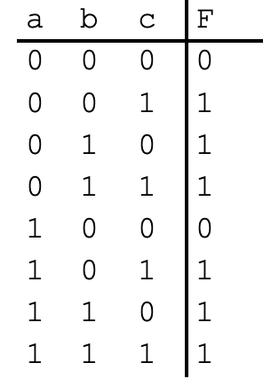

---
title:
author:
partner:
date:
---

In the report, complete the following.
- Explain the objective of the problem.
- Give your solution.
- Include all your project codes in the [codes/assg](../../codes/assg) folder,
  if required.
- Explain your code snippets, if required.
- Include screenshots of the simulations in this folder, and insert them into
  the markdown file, if required.
- Explain why the simulations are correct, if required.

You can embed math equations into Github Markdown file using a [web service](https://www.codecogs.com/latex/eqneditor.php)

## (5 pts)
Use algebraic manipulation to convert the following equation to sum-of-products form: F = a(b + c)(d’) + ac’(b + d)

## (5 pts)
 Use DeMorgan’s Law to find the inverse of the following equation: F = abc + a’b. Reduce to sum-of-products form. Hint: Start with F’ = (abc + a’b)’

## (5 pts)
Convert the following Boolean equations to a digital circuit:
- a. F(a,b,c) = a’bc + ab
- b. F(a,b,c) = a’b
- c. F(a,b,c) = abc + ab + a + b + c
- d. F(a,b,c) = c’

## (5 pts)
Convert the Boolean equations in the problem above to truth tables

## (5 pts)
Convert the function F shown in the truth table in to an equation. Don’t minimize the equation.

## (5 pts)
Convert the function F shown in the truth table above to a digital circuit.

## (5 pts)
Implement the digital circuit above with Verilog. Create a teatbench including
all input combinations in the truth table above. Verify the circuit's output with
simulation. Provide the simulated waveform of the testbench.

## (5 pts)
Determine whether the Boolean functions F = (a + b)’*a and G = a + b’ are equivalent, using: (a) algebraic manipulation, and (b) truth tables.
